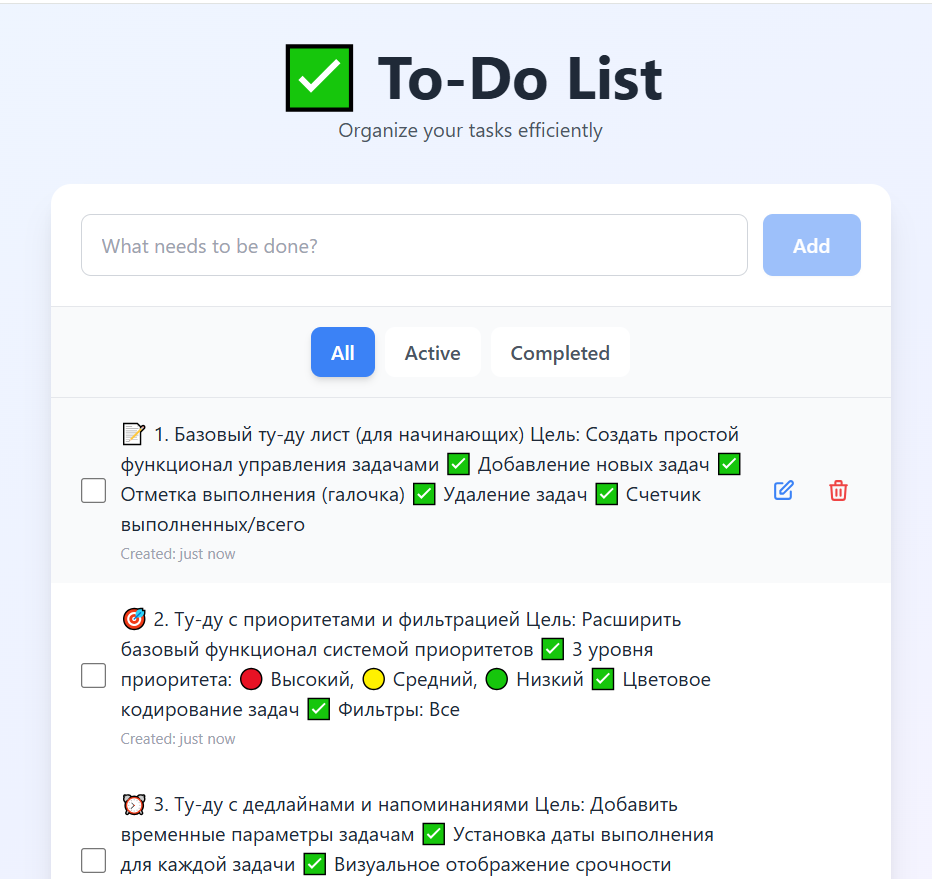

# ✅ Vue To-Do List App

[](https://your-app-url.vercel.app)
[](https://opensource.org/licenses/MIT)
[](https://vuejs.org/)
[](https://www.typescriptlang.org/)

A modern, feature-rich to-do list application built with Vue.js 3, Pinia for state management, and Tailwind CSS. Manage your tasks efficiently with a clean and intuitive interface.



## ✨ Features

- ✅ **Add Tasks** - Quickly add new tasks with a simple input
- 🎯 **Mark as Complete** - Check off completed tasks
- ✏️ **Edit Tasks** - Double-click to edit task text
- 🗑️ **Delete Tasks** - Remove tasks you no longer need
- 🔍 **Filter Tasks** - View all, active, or completed tasks
- 💾 **Local Storage** - Tasks persist across browser sessions
- 📊 **Task Counter** - See how many tasks are left to complete
- 🎨 **Modern UI** - Beautiful design with smooth animations
- 📱 **Fully Responsive** - Works seamlessly on all devices
- ⚡ **Fast Performance** - Built with Vite for optimal speed

## 🛠️ Tech Stack

- **Framework**: [Vue.js 3](https://vuejs.org/) (Composition API)
- **State Management**: [Pinia](https://pinia.vuejs.org/)
- **Language**: [TypeScript](https://www.typescriptlang.org/)
- **Styling**: [Tailwind CSS](https://tailwindcss.com/)
- **Build Tool**: [Vite](https://vitejs.dev/)
- **Deployment**: [Vercel](https://vercel.com/)

## 📸 Screenshots

### Main Interface


### Task Management


## 🚀 Getting Started

### Prerequisites

- Node.js 18+ and npm

### Installation

1. **Clone the repository**
```bash
   git clone https://github.com/yourusername/vue-todo-app.git
   cd vue-todo-app
```

2. **Install dependencies**
```bash
   npm install
```

3. **Run the development server**
```bash
   npm run dev
```

4. **Open your browser**
   
   Navigate to [http://localhost:5173](http://localhost:5173)

## 📦 Build for Production
```bash
npm run build
npm run preview
```

## 🌐 Deployment

This project is optimized for deployment on Vercel:

1. Push your code to GitHub
2. Import your repository on [Vercel](https://vercel.com)
3. Deploy!

[](https://vercel.com/new/clone?repository-url=https://github.com/yourusername/vue-todo-app)

## 🎯 Project Structure
```
vue-todo-app/
├── public/              # Static assets
├── src/
│   ├── components/      # Vue components
│   │   ├── TodoInput.vue
│   │   ├── TodoFilters.vue
│   │   ├── TodoList.vue
│   │   ├── TodoItem.vue
│   │   └── TodoFooter.vue
│   ├── stores/          # Pinia stores
│   │   └── todoStore.ts
│   ├── App.vue          # Root component
│   ├── main.ts          # App entry point
│   └── style.css        # Global styles
├── index.html
├── package.json
├── vite.config.ts
├── tailwind.config.js
└── tsconfig.json
```

## 💡 Usage

1. **Add a Task**: Type your task in the input field and click "Add" or press Enter
2. **Complete a Task**: Click the checkbox next to a task to mark it as complete
3. **Edit a Task**: Double-click on the task text to edit it
4. **Delete a Task**: Click the trash icon to remove a task
5. **Filter Tasks**: Use the filter buttons to view all, active, or completed tasks
6. **Clear Completed**: Click "Clear completed" to remove all finished tasks

## 🤝 Contributing

Contributions are welcome! Please feel free to submit a Pull Request.

1. Fork the project
2. Create your feature branch (`git checkout -b feature/AmazingFeature`)
3. Commit your changes (`git commit -m 'Add some AmazingFeature'`)
4. Push to the branch (`git push origin feature/AmazingFeature`)
5. Open a Pull Request

## 📄 License

This project is licensed under the MIT License - see the [LICENSE](LICENSE) file for details.

## 👨‍💻 Contact

**Your Name**

- 💼 LinkedIn: [Your LinkedIn](https://linkedin.com/in/yourprofile)
- 🌐 Upwork: [Your Upwork Profile](https://upwork.com/freelancers/yourprofile)
- 📧 Email: your.email@example.com
- 🐙 GitHub: [@yourusername](https://github.com/yourusername)

---

⭐ If you like this project, please give it a star on GitHub!

**Made with ❤️ using Vue.js, Pinia, and Tailwind CSS**
